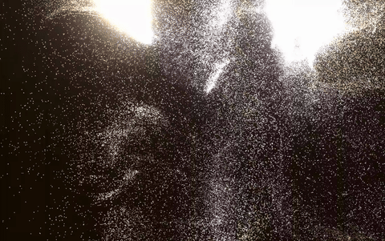

# Latent Currents

An immersive, real-time generative art installation. It simulates up to **1,000,000 particles** entirely on the GPU at 60 FPS, responding dynamically to ambient soundscapes and physical human movement captured via webcam.



---

## Features

- **GPU Acceleration (GPGPU):** Position and velocity equations integrated on the GPU via customized WebGL fragment shaders.
- **Webcam Motion Interaction:** Real-time JavaScript **optical flow** grid estimates velocity vectors from your camera stream, driving the physical currents.
- **Acoustic Synthesizer:** Multi-voice FM synthesizer that responds dynamically to flow speed and particle collisions.
- **Newtonian Gravity & Inertia:** Physical drag, mass distribution, and wall splash deflections for an organic, liquid feel.
- **Dynamic Color Presets:** Curated high-contrast color palettes (Paint, Neon, Monolith, Nebula) matching time-of-day moods.
- **In-Browser Recording:** Capture and export high-definition 5-second WebM loops directly from the control drawer.

---

## Inspiration & Credits

- **Artistic Inspiration:** This project is a creative homage to the experiential qualities of **Refik Anadol's *Unsupervised* (2022–2023)**, originally exhibited at the Museum of Modern Art (MoMA).
- **Development & Design:** Coded and co-designed by **Antigravity** (Google DeepMind's Advanced Agentic Coding assistant) in partnership with **Carlos Rodriguez**.

---

## Getting Started

### Prerequisites

Make sure you have [Node.js](https://nodejs.org/) installed.

### Installation

1. Clone and navigate to the project directory:
   ```bash
   git clone git@github.com:crodriguez1a/latent-currents.git
   cd latent-currents
   ```
2. Install dependencies:
   ```bash
   npm install
   ```
3. Launch local dev server:
   ```bash
   npm run dev
   ```
   Open the browser at `http://localhost:5173`.

### Build & Production Release

Compile TypeScript and build the optimized production assets:
```bash
npm run build
```
Production bundles will be written to the `dist/` directory, ready to serve or host.
